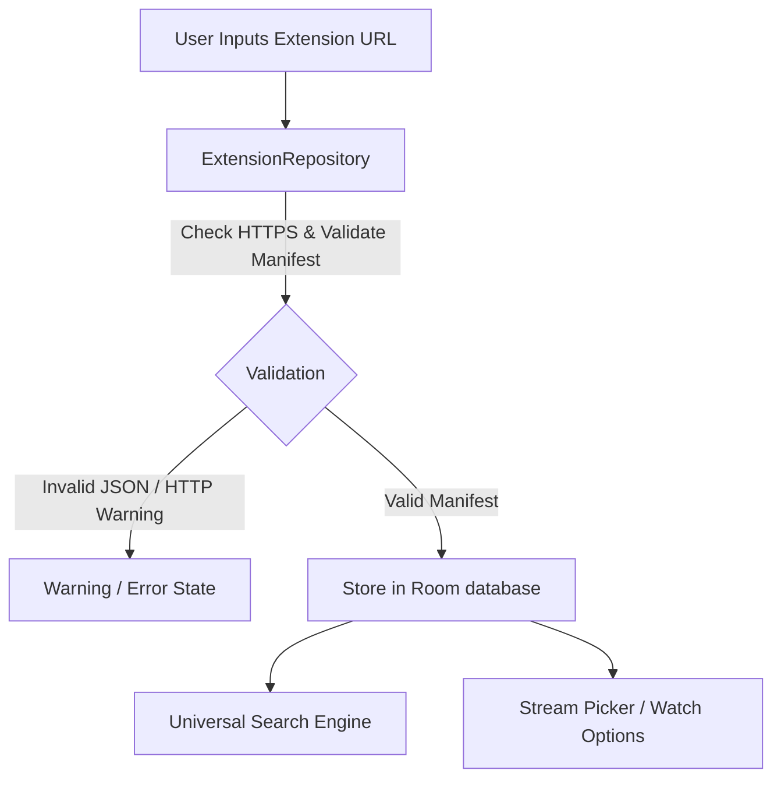

# CalmSource Extension Hub Architecture & Foundation

This document details the architecture, models, security boundaries, and integration pipelines for CalmSource's Extension Hub.

---

## 1. High-Level Architecture

The Extension Hub allows users to extend the catalog and stream indexing capabilities of CalmSource by registering compatible, user-provided remote URLs. 

The architecture is built on three core design tenets:
1.  **Isolation**: Extensions are external metadata services, not executable code. No custom scripts, executable binaries, or native libraries are loaded or executed.
2.  **Safety & Verification**: Remote URL registration enforces HTTPS and validates manifest schemas. 
3.  **Non-Blocking Integration**: External extensions communicate with CalmSource via JSON APIs. The search engine queries extensions concurrently and applies strict timeout policies so slow or failed remote services do not freeze the media player UI.

---

## 2. Models & Schema Mappings

All Extension Hub models are defined in [Models.kt](file:///d:/Program%20Files/iptv/core/model/src/main/kotlin/com/example/calmsource/core/model/Models.kt):

### A. Manifest Schema (`ExtensionManifest`)
Describes metadata, supported content categories, and resources:
*   `id`: String (Unique identifier, e.g., `ext-torrentio`).
*   `name`: String (Human-readable extension label).
*   `description`: String? (Optional summary of provided services).
*   `version`: String? (Version string).
*   `logo`: String? (Optional URL pointing to an icon).
*   `resources`: List<String> (Exposed capabilities).
*   `types`: List<String> (Content types supported, e.g., `movie`, `series`).
*   `catalogs`: List<ExtensionCatalog> (Discovered directory paths).
*   `behaviorHints`: Map<String, String> (Tuning configuration).
*   `rawAttributes`: Map<String, String> (Stores unknown/extended JSON keys for compatibility with future schema versions).

### B. Capabilities (`ExtensionCapability`)
Determines what actions the extension can perform:
*   `catalog`: Exposes categories or rows of media titles.
*   `search`: Allows searching catalogs using keyword text queries.
*   `metadata`: Enriches detail screens with synopses, cast info, and ratings.
*   `stream`: Resolves video stream URLs (qualities, audio options).
*   `subtitles`: Discovers external subtitle tracks.
*   `addonCatalog`: Discovers compatible sub-addons.
*   `sourceResolverPlaceholder`: Reserves hooks for advanced resolver engines.

### C. Permissions (`ExtensionPermission`)
CalmSource restricts extension capabilities using a declarative permission model:
*   `INTERNET`: Authority to query remote HTTP endpoints.
*   `LOCAL_FILES`: Read/write local index cache stores.
*   `PLAYBACK_CONTROL`: Interact with player controls (subtitles, audio track switching).
*   `READ_METADATA`: Read details of current media selection to match streams.

### D. Health States (`ExtensionHealth`)
Indicates operational integrity and status of the extension:
*   `ACTIVE`: Healthy and responsive.
*   `DISABLED`: Installed but turned off by user.
*   `NEEDS_CONFIGURATION`: Requires authentication keys or setup headers.
*   `SLOW`: Resolves queries slower than the timeout policy.
*   `FAILED`: Unreachable or threw network exceptions.
*   `INVALID_MANIFEST`: Schema parsing succeeded with critical errors.
*   `UNKNOWN`: Unverified initialization status.

---

## 3. Storage & Operations (`ExtensionRepository`)

The [ExtensionRepository.kt](file:///d:/Program%20Files/iptv/feature/extensions/src/main/kotlin/com/example/calmsource/feature/extensions/ExtensionRepository.kt) manages active extensions in the **Room database** and exposes modifications as a live `StateFlow`:

1.  **Add Extension**:
    *   Verifies URL structure (must start with `http://` or `https://`).
    *   Prefers `https://` and returns safety warning flags for plain HTTP connections.
    *   Tolerates malformed JSON payloads and extracts partial metadata safely, returning parse warnings to the user.
2.  **Enable/Disable**: Modifies the `isEnabled` flag and adjusts health status to `DISABLED`.
3.  **Priority**: Re-orders priority indexing. Lower priority integers are evaluated first by the search and stream picker.
4.  **Remove**: Deletes from database.
5.  **Health Tracking**: Tracks runtime performance and updates extension status when failures or high latency are observed.
6.  **Config URL Compiler**: Interpolates and templates dynamic paths, saving secret variables securely in `SecureTokenStore` and keeping Room database clean of raw tokens.

---

## 4. Search & Stream Picker Integration

### Universal Search
*   `ExtensionSearchProviderImpl` queries registered, enabled extensions concurrently.
*   Results are matched by Title and merged into a single consolidated card.
*   If IPTV VOD, Debrid cache, and multiple extensions match the same movie, the search screen displays a unified title card (e.g. *Spider-Man: Homecoming*) showing available badges (`IPTV`, `Extension`, `Debrid`) in a clean, quiet overlay.

### Stream Picker / Watch Options
*   When a user clicks "Play", the Stream Picker aggregates matches from all sources.
*   It computes a quality priority score based on user preferences.
*   It formats clean, readable labels (e.g., **4K**, **1080p**, **HDR**, **Dolby Vision**, **Atmos**, **Subtitles**, **Extension**, **Cached**, **Low Data**) instead of displaying raw torrent filenames.
*   Raw file details are collapsed under **Advanced Details** to prevent visual clutter.

---

## 5. Security & Legal Boundaries

CalmSource operates purely as a legal media player and source manager. 
*   **No Bundling**: The software does not ship with pre-loaded piracy catalogs, scraper engines, DRM bypassing scripts, or Torrentio endpoints.
*   **HTTPS Warnings**: Users are warned before enabling unverified, non-HTTPS source URLs.
*   **Privacy-Friendly**: Calmsource never logs user API tokens, extension query keys, or personal credentials.
*   **Execution Isolation**: Communication occurs solely via declarative JSON schemas. Sandboxed parser rules prevent remote code execution (RCE).

---

## 6. Real vs. Fake Implementation Status

| Component | Real Implementation | Fake / Simulated Prototype |
| :--- | :--- | :--- |
| **Manifest Parser** | **100% Real**: `ExtensionManifestParser` reads JSON, isolates raw attributes, and yields warnings. | N/A |
| **Extension Storage** | **100% Real**: `ExtensionRepository` uses Room database entities (`ExtensionProviderEntity`) to persist installed addons. | N/A |
| **D-pad settings** | **100% Real**: Fully navigable split-pane with capability checkmarks, priority toggles, configuration flow fields, and manifest inspector. | N/A |
| **Network Fetching** | **100% Real**: `ExtensionManifestLoader` and `StremioAddonClient` use Ktor to fetch external manifests and query endpoints securely with strict timeouts. | N/A |

---

## 7. Next Steps & Timeline

1.  **OAuth/API Key integrations for Debrid**: Now that the core Stremio protocol pipeline and secure storage are completed, we can build the real REST network client integration for Debrid APIs (Real-Debrid, AllDebrid, Premiumize).
