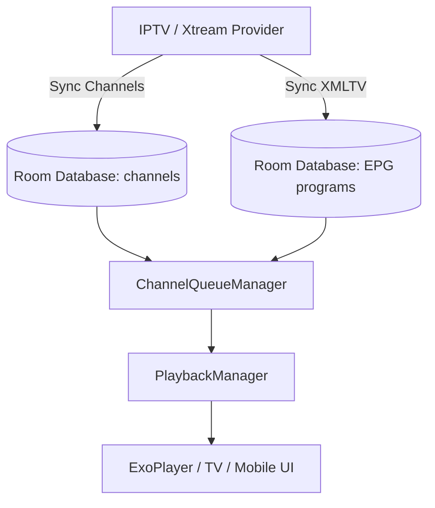

# Live TV Playback Specifications

This document outlines the architecture, data flows, and performance considerations for Live TV playback, Electronic Program Guide (EPG) matching, and Xtream Codes integration in CalmSource.

---

## 1. High-Level Architecture

The Live TV component integrates linear stream sources (from M3U playlists and Xtream Codes servers) with dynamic schedule grids (from XMLTV EPG databases). 

---

## 2. electronic Program Guide (EPG) Integration

### A. Performing Matches
CalmSource matches channels to their EPG program guides using a **4-tier matching strategy** in decreasing order of priority:
1.  **Exact ID Match**: M3U `tvg-id` exactly matches XMLTV `<channel id="...">`.
2.  **Normalized TVG Name Match**: Compares `tvg-name` and `<display-name>` after converting to lowercase and stripping spacing and non-alphanumeric characters.
3.  **Normalized Name Match**: Standardizes and compares the raw channel name with the display name.
4.  **Fuzzy Fallback**: Evaluates if the normalized name of one is contained within the other.

### B. O(1) Performance Lookups
To prevent D-pad lag when scrolling through a grid of hundreds of channels:
*   EPG guide programs are indexed and grouped by `channelId` into a pre-computed map.
*   The UI performs $O(1)$ lookups for the current and next programs (`getNowNextForChannels()`), bypassing expensive sequential $O(N)$ database scans during lazy list recompositions.

---

## 3. Playback Queue & Channel Switching

### A. Queue Management
The `ChannelQueueManager` tracks the active channel sequence for TV D-pad navigation (Up/Down) or Mobile swipe gestures:
*   **Looping / Wrapping**: Reaching the end of the channel list wraps focus back to the beginning.
*   **Skip Unhealthy Channels**: If a channel stream is marked as `FAILED` in the database, the manager automatically skips to the next healthy channel.

### B. Safe Player Reuse
To eliminate screen flicker and audio pops during channel changes:
*   The system reuses the same `ExoPlayer` instance when switching channels within the same provider.
*   `PlaybackManager` calls `player.setMediaItem()` directly rather than tearing down and reconstructing the `MediaCodec` pipeline, reducing channel tune-in times on low-end Android TV devices to less than 400ms.

---

## 4. Xtream Codes API Integration

CalmSource supports direct Xtream Codes API integration for live TV:
*   **Import**: Channels and VOD streams are retrieved via Xtream category and stream list API endpoints (`get_live_categories`, `get_live_streams`).
*   **Secure Storage**: Xtream server configurations are stored in Room, but user credentials (username and password pairs) are saved strictly in `IptvSecureTokenStore`, backed by Android Keystore.
*   **Deletion Lifecycle**: Uninstalling or deleting an Xtream provider immediately purges its token mappings from the keystore.
*   **Live Stream URL Construction**: Live stream URLs are built lazily at playback time: `{server}/live/{username}/{password}/{stream_id}.ts`. The URL is constructed from the `stream_id` (stored in Room) and credentials (retrieved from SecureTokenStore) — never persisted to disk or logs.
*   **Channel Switching**: Xtream live channels participate in the standard `ChannelQueueManager` for D-pad up/down or swipe navigation, with the same player reuse and 150ms debounce as M3U-sourced channels.
*   **EPG Integration**: Short EPG data is fetched per-stream via `get_short_epg` when available, and matched to channels using the standard 4-tier matching strategy.

> For complete Xtream API endpoint specifications, sync pipeline, and credential storage rules, see [XTREAM_SYNC.md](./XTREAM_SYNC.md).

---

## 5. Security & URL Redaction

### A. Privacy Redaction
To prevent credentials from leaking into logfiles:
*   All Xtream live playback URLs containing authentication parameters (e.g., `http://server.com/live/username/password/123.ts`) are redacted via `PlaybackSource.redactUrl` prior to logging or UI output.
*   Logs strip basic auth prefixes (`user:pass@host`) and mask username/password parameters.

### B. Error Obfuscation
*   Raw socket connection errors and HLS parsing dumps are caught in `onPlayerError`.
*   Errors are mapped to user-friendly codes (e.g. `PlaybackError.ServerRefused` or `Source Unavailable`) to prevent raw, credential-bearing URLs from being printed on the screen.

---

## 6. Performance Optimization Checklist

*   **InputStream Chunking**: Large M3U lists (50k+ channels) are parsed line-by-line using chunked streams to keep RAM usage below 10MB.
*   **XMLTV Preamble Skip**: Scanners skip EPG header metadata before parsing program schedules, preventing OOM crashes on 1GB RAM TV boxes.
*   **150ms Switch Debounce**: A debounce threshold prevents ExoPlayer from executing rapid back-to-back channel buffers.
*   **Timeline State Separation**: Time/scrub updates are routed via a separate state flow, shielding the heavy video canvas from frequent Compose recompositions.

---

## 7. Further Documentation
*   For details on general media playback, see [PLAYBACK.md](./PLAYBACK.md).
*   For dynamic source health telemetry and fallback, see [SOURCE_HEALTH_AND_FALLBACK.md](./SOURCE_HEALTH_AND_FALLBACK.md).
