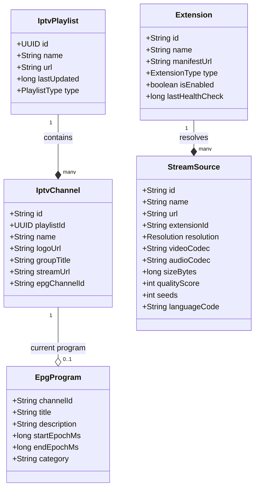
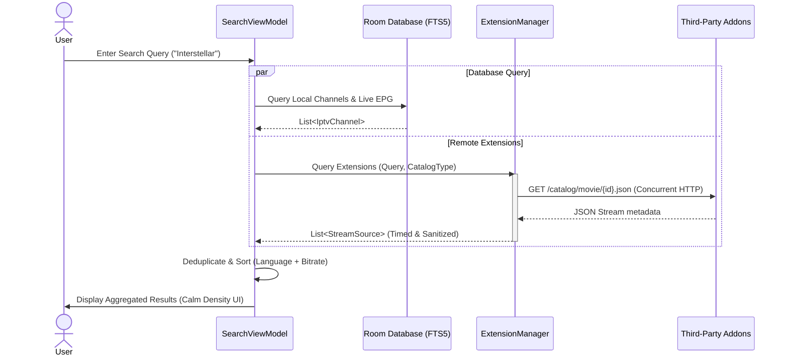
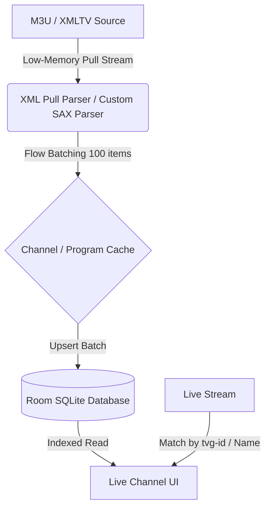
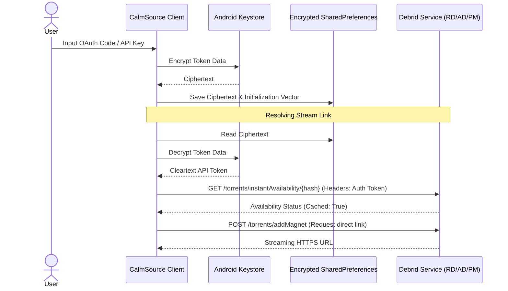
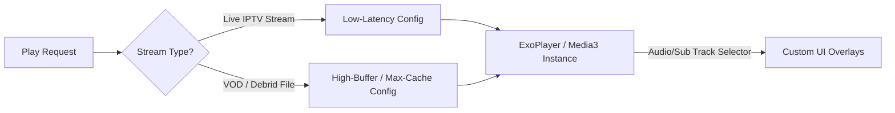

# CalmSource Research & Architecture Report

CalmSource is a premium, legal, open-extensible IPTV and media aggregator client for Android (Phone/Tablet) and Android TV. This document outlines the technical research, architecture, and design specifications for building CalmSource from the ground up, complying with legal boundaries while delivering a high-performance, visually stunning experience on all Android platforms.

---

## 1. Product Summary & Vision

CalmSource is designed as a unified, high-performance media browser and player. It decouples the core media player engine and catalog system from the underlying stream sources. Out of the box, it contains no proprietary streams, scrapers, or illegal catalogs. Instead, it serves as a powerful utility for users to mount their own IPTV playlists, standard XMLTV Electronic Program Guides (EPG), and extension URLs (using Stremio-compatible, Torrentio-compatible, and AIOStreams-style JSON API protocols).

### Design Philosophy: Calm Density
IPTV and torrent media players are notoriously cluttered, flashy, and visually chaotic. CalmSource introduces **Calm Density**:
*   **Default State (Simple)**: Minimalist, clean grid/list layout. Empty space is respected. Large, clean typography (e.g., *Inter* or *Outfit* fonts), smooth gradients, and glassmorphic card boundaries.
*   **Focus State (Informative)**: When the D-pad (on TV) or gesture/long-press (on mobile) focuses on an item, it smoothly reveals supplementary information—e.g., video resolution, audio codecs, stream health, seed count, or EPG progress bar—without displacing surrounding elements.
*   **Intent State (Detailed)**: When a user clicks or confirms an action, a detail panel (modal sheet or dedicated view) rises with full metadata, a structured stream picker, and rich source ranking lists.

---

## 2. Recommended Tech Stack

The selected stack balances developer velocity, cross-device compatibility, modern Jetpack standards, and performance constraints of low-end Android TV hardware.

```
+-------------------------------------------------------------------+
|                        UI Layer (Jetpack Compose)                 |
|   +---------------------------------+-------------------------+   |
|   |         :app-tv (TV UI)         |    :app-mobile (Mobile) |   |
|   +---------------------------------+-------------------------+   |
+-------------------------------------------------------------------+
|                 Shared Business Logic & Features                  |
|     +--------------------+-------------------+---------------+     |
|     | :feature:iptv      | :feature:search   | :feature:debrid|     |
|     +--------------------+-------------------+---------------+     |
|     | :feature:playback  | :feature:extensions               |     |
|     +--------------------+-----------------------------------+     |
+-------------------------------------------------------------------+
|                         Core Libraries Layer                      |
|  +--------------------+-------------------+---------------------+  |
|  | :core:database     | :core:network     | :core:parser        |  |
|  | (Room + SQLite FTS)| (Ktor + OkHttp)   | (Streaming M3U/XML) |  |
|  +--------------------+-------------------+---------------------+  |
|  | :core:model        | :core:playback-api                      |  |
|  +--------------------+-----------------------------------------+  |
+-------------------------------------------------------------------+
```

| Component | Technology | Rationale |
| :--- | :--- | :--- |
| **Language** | Kotlin (1.9.20+) | Official language, type safety, powerful asynchronous patterns (Coroutines/Flow). |
| **UI Framework** | Jetpack Compose / Jetpack Compose for TV | Unified UI paradigm, declarative state, component reusability, and dynamic focus APIs. |
| **Playback Engine** | AndroidX Media3 / ExoPlayer (1.3+) | Modern replacement for standalone ExoPlayer. Native lifecycle mapping, DRM, HLS/DASH, and live tuning. |
| **Dependency Injection** | Hilt (Dagger 2) | Official Android standards for DI, scope management, and ViewModel integration. |
| **Database & Cache** | Room SQLite (with FTS5) | Object-relational mapping, transactional integrity, and native full-text search capability. |
| **Networking** | OkHttp 4 + Ktor Client | Ktor for flexible multiplatform-friendly calls; OkHttp engines underneath for caching and connection pooling. |
| **Serialization** | Kotlinx Serialization (JSON) | Compiler-plugin-driven speed, type safety, and memory-efficient deserialization. |
| **Image Loading** | Coil | Compose-first image library, supports custom interceptors, memory/disk cache sizing, and TV focus transition handling. |
| **Concurrency** | Kotlin Coroutines & Flow | Structured concurrency, reactive UI updates, low overhead, and asynchronous streaming. |

---

## 3. Module & Package Architecture

A highly decoupled, multi-module structure is critical. It ensures compile-time boundaries, optimizes parallel compilation, and segregates mobile-specific layouts from Android TV focus-management code.

### Gradle Module Tree
*   `:app-mobile`: Entry point for phones and tablets. Handles mobile routing, system gesture navigation, mobile splash screen, and touch-friendly controls.
*   `:app-tv`: Entry point for Android TV/Fire TV. Handles Leanback-like navigation, D-pad focus management, TV settings layouts, and custom TV playback overlays.
*   `:core:model`: Pure Kotlin library containing shared data structures, constants, and domain models. Free of Android framework dependencies.
*   `:core:database`: Contains Room Database configurations, DAOs, migrations, and entities (Channels, Playlists, EPG, Extensions).
*   `:core:network`: Network configurations, standard clients, interceptors (for Debrid token addition), DNS over HTTPS (DoH), and rate limiters.
*   `:core:parser`: High-performance streaming parsers for M3U formats and large XMLTV files, optimized to prevent heap exhaustion.
*   `:core:playback-api`: Interfaces and states for Media3 abstraction, isolating video playback business logic from specific UI code.
*   `:core:playback`: Implementation of `PlayerManager`, custom ExoPlayer setup (buffer controls, track selection), and DRM support.
*   `:feature:iptv`: Sync mechanisms for playlists, active live channel indexing, VOD parsing, and EPG mapping engines.
*   `:feature:search`: Orchestration of search queries. Combines local database indices and remote extension responses concurrently.
*   `:feature:extensions`: Sandbox runner, protocol parser for Stremio-compatible endpoints, health checking, safety isolation, and URL routing.
*   `:feature:debrid`: SDK-like logic interacting with Real-Debrid, Premiumize, and AllDebrid APIs. Handles magnet resolution, caching status checks, and stream transformations.

---

## 4. Core Data Models

To enforce standard data interchange between components, core domain models are defined in `:core:model`.



### Kotlin Target Schemas

```kotlin
// In :core:model

enum class PlaylistType { M3U_LIVE, M3U_VOD, XC_API }
enum class ExtensionType { STREMIO_ADDON, AIOSTREAMS, TORRENTIO_STYLE }

data class IptvPlaylist(
    val id: String,
    val name: String,
    val url: String,
    val type: PlaylistType,
    val lastUpdated: Long
)

data class IptvChannel(
    val id: String,
    val playlistId: String,
    val name: String,
    val logoUrl: String?,
    val groupTitle: String?,
    val streamUrl: String,
    val epgChannelId: String? // Maps to <channel id="..."> in XMLTV
)

data class EpgProgram(
    val id: String,
    val channelId: String,
    val title: String,
    val description: String?,
    val startEpochMs: Long,
    val endEpochMs: Long,
    val category: String?
)

data class Extension(
    val id: String,
    val name: String,
    val manifestUrl: String,
    val type: ExtensionType,
    val isEnabled: Boolean,
    val lastHealthCheck: Long,
    val supportedTypes: List<String> // e.g. ["movie", "series", "tv"]
)

data class StreamSource(
    val id: String,
    val name: String,
    val url: String,
    val extensionId: String,
    val resolution: Resolution,
    val videoCodec: String?,
    val audioCodec: String?,
    val sizeBytes: Long?,
    val qualityScore: Int,
    val seeds: Int?,
    val languageCode: String // ISO 639-1 code
)

enum class Resolution {
    SD_480P, HD_720P, FHD_1080P, UHD_4K, UNKNOWN;
    companion object {
        fun fromString(valStr: String): Resolution = ...
    }
}
```

---

## 5. Universal Search Pipeline

Universal Search acts as a central aggregator, executing local DB searches and calling remote third-party extensions in parallel.



### Execution Details
1.  **FTS5 Local Matching**: The app indexes local channels and active EPG guides inside a Room FTS5 virtual table. Match expressions execute in under 10ms.
2.  **Concurrent Remote Extensions Fetch**: Remote URLs (Stremio/Torrentio manifests) are polled using Kotlin Coroutines `async` with a strict `withTimeout(3000)` wrapper. This ensures a hanging URL cannot block search completions.
3.  **Search Merging**:
    ```kotlin
    fun executeUniversalSearch(query: String): Flow<SearchResult> = flow {
        coroutineScope {
            val dbDeferred = async { roomDb.searchChannels(query) }
            val extDeferred = activeExtensions.map { ext ->
                async { 
                    runCatching { 
                        extService.searchCatalog(ext, query) 
                    }.getOrDefault(emptyList()) 
                }
            }
            
            val dbResults = dbDeferred.await()
            emit(SearchResult.Local(dbResults))
            
            val remoteResults = extDeferred.awaitAll().flatten()
            emit(SearchResult.Combined(dbResults, remoteResults))
        }
    }
    ```

---

## 6. IPTV Pipeline (M3U, XMLTV, VOD, and EPG Matching)

One of the largest bottlenecks on low-end Android TVs (with 1.5GB or less RAM) is parsing massive, multi-megabyte M3U playlists and EPG files (often 100MB+ XML).



### High-Performance Parsing Strategy
*   **Avoid Loading in Memory**: Never use DOM parsing. XMLTV utilizes `XmlPullParser` or SAX parser to stream node-by-node.
*   **Batching Database Writes**: Channel and program additions run in transactions in chunks of 100 to 500 records using Room's `@Insert(onConflict = OnConflictStrategy.REPLACE)` inside a coroutine running on `Dispatchers.IO`.
*   **EPG Mapping Algorithm**:
    1.  **Direct Match**: Checks if the channel's `tvg-id` is equal to the EPG's channel `<channel id="...">` tag.
    2.  **Name Match**: Fallback to checking matches between `tvg-name` / `channel name` and EPG channel display names.
    3.  **Fuzzy Fallback**: Uses normalized Levenshtein distance on lowercase, space-stripped channel names, mapping only if the similarity score is $>0.85$.
*   **Database Cleanup**: Maintain a worker that deletes EPG entries where `endEpochMs < System.currentTimeMillis() - 86400000` (older than 24 hours).

---

## 7. Extension Pipeline & Security

To enable Stremio, Torrentio-style, and AIOStreams-compatible extensibility without compromising player safety, extensions are executed under strict sandboxing.

```
+-------------------------------------------------------------+
|                     Extension Manager                       |
|  +--------------------+----------------------------------+  |
|  | Manifest Validator |  URL Parser & Router             |  |
|  +--------------------+----------------------------------+  |
|  | Sandbox Executor (Limited Headers, Custom HTTP Client)|  |
|  +--------------------+----------------------------------+  |
+-------------------------------------------------------------+
                            |
                            v (HTTPS)
                 +----------------------+
                 |  Third-Party Addon   |
                 +----------------------+
```

### Extension Configuration & Lifecycle
1.  **Registration**: User registers an extension via URL (e.g., `https://example.com/manifest.json`).
2.  **Validation**: Manifest is checked for strict schema formats:
    *   Must define unique `id`, `version`, `name`, `resources`, `types`, and `catalogs`.
    *   No script injection or execution payload allowed. Content is restricted entirely to JSON declarations of metadata and streams.
3.  **Sandbox Isolation**:
    *   All external HTTP network interactions go through a dedicated client with disabled cookies and isolation headers to avoid session leakage.
    *   Maximum JSON payload parser limit: 2MB per payload (prevents Heap Overflow attacks).
    *   No dynamic class loading (`DexClassLoader`) is permitted for extensions. Extensions are static declarative descriptors.
4.  **Health Checks**: A background worker checks extension connectivity daily. If an extension fails multiple consecutive calls or times out, it is auto-disabled, and the user is notified.

---

## 8. Debrid Pipeline

A major utility of CalmSource is enabling premium streaming using official Debrid HTTP APIs (Real-Debrid, Premiumize, AllDebrid).

### Process Flow
1.  **Official Authentication**: Secure OAuth2 configuration flow or direct API key entry by user.
2.  **API Token Storage**: Tokens are encrypted using Android Keystore System before storage.
3.  **Magnet Resolution**:
    *   When a Torrentio-style stream is picked, it returns an info hash or magnet link.
    *   The application queries the Debrid cache state (`GET /torrents/instantAvailability` on Real-Debrid).
    *   If cached, the application initiates instant streaming by adding the magnet and requesting the direct streaming link (`POST /torrents/addMagnet` and `/torrents/selectFiles`).
    *   If not cached, the application prompts the user to download it to their cloud drive (no automatic download initiated).



---

## 9. Playback Pipeline (Media3 / ExoPlayer)

The application relies on Media3 to handle both live streams (HLS/DASH/MPEG-TS) and VOD files (MKV/MP4/WebM).



### Buffering & Performance Customization
*   **Live Stream Profiles (IPTV)**:
    *   `minBufferMs` = 1,500ms
    *   `maxBufferMs` = 5,000ms
    *   `bufferForPlaybackMs` = 800ms
    *   *Why*: Fast channel switching times (Zapping). High buffers cause annoying delay when swapping channels.
*   **VOD Streams (Large Movie files/Debrid)**:
    *   `minBufferMs` = 15,000ms
    *   `maxBufferMs` = 50,000ms
    *   `bufferForPlaybackMs` = 2,500ms
    *   *Why*: Prevents buffering on high-bitrate 4K files under fluctuating network speeds.
*   **Track Selection & Audio Passthrough**:
    *   Native integration of `DefaultTrackSelector` to enable language-based audio preference routing.
    *   Passthrough audio configuration supporting Dolby Digital (AC3), Dolby Digital Plus (E-AC3), and DTS options where hardware output allows.
*   **Subtitles**: Support for embedded subtitles (PGS, SRT, ASS/SSA) and external SRT subtitles.

---

## 10. TV Navigation Strategy (D-pad Focus)

Android TV applications live or die based on focus management. We enforce D-pad navigation strictly in Jetpack Compose for TV.

### Focus Management Rules
1.  **No Trapped Focus**: Moving back should always bring the user back to the side menu, parent category, or exit safely.
2.  **Focus Restoration**: Memorize the previously focused index when returning to a long lazy list.
3.  **Calm Density Transitions**:
    *   Default State: Small card boundaries, standard text labels, minimal description text.
    *   Focused State: Card scales by 1.1x with a subtle border glow. Additional lines (resolution, stream size, source engine logo) fade in.
    *   Intent State: Clicking a VOD title displays a modal backdrop containing full plots, cast lists, and a dedicated scrollable stream list.

```kotlin
// Example TV Card with Calm Density focus principles
@Composable
fun TVMediaCard(
    mediaItem: MediaItem,
    onClicked: () -> Unit
) {
    var isFocused by remember { mutableStateOf(false) }
    val cardScale by animateFloatAsState(if (isFocused) 1.1f else 1.0f, label = "card_scale")
    
    Card(
        onClick = onClicked,
        modifier = Modifier
            .scale(cardScale)
            .onFocusChanged { state -> isFocused = state.isFocused }
            .border(
                width = if (isFocused) 2.dp else 0.dp,
                color = if (isFocused) MaterialTheme.colorScheme.primary else Color.Transparent,
                shape = RoundedCornerShape(8.dp)
            )
    ) {
        Column(modifier = Modifier.padding(12.dp)) {
            Text(text = mediaItem.title, style = MaterialTheme.typography.titleMedium)
            
            // Calm Density: Only display meta indicators when focused
            AnimatedVisibility(visible = isFocused) {
                Row(horizontalArrangement = Arrangement.spacedBy(8.dp)) {
                    Badge(text = mediaItem.resolution)
                    Badge(text = mediaItem.codec ?: "H.264")
                    if (mediaItem.size != null) {
                        Text(text = mediaItem.size, style = MaterialTheme.typography.bodySmall)
                    }
                }
            }
        }
    }
}
```

---

## 11. Mobile Navigation Strategy

For mobile devices (phones, tablets, foldables), we implement touch-optimized interactions and standard Jetpack Compose Navigation.

### Key Interaction Patterns
*   **Bottom Navigation**: Simple destinations (Home, IPTV Guide, Search, Extensions, Settings).
*   **Swipe Gestures**:
    *   During playback: Swipe vertically on the left side of the screen to adjust brightness; swipe vertically on the right side to adjust volume.
    *   Horizontal swipe adjusts playback position (scrubbing) with a precision zoom track preview.
*   **PIP (Picture-in-Picture) Mode**: Automatic transition to PiP when the user swipes home while watching a live TV channel or VOD content.
*   **Dynamic Layout Adaptive Scaffolding**: Detect screen size changes. On tablet landscape orientations, display a persistent sidebar on the left and a double grid of content channels.

---

## 12. Source Ranking Strategy

When a user selects a file or live channel resolved by multiple extensions, CalmSource calculates a custom quality score for sorting.

```
                  +--------------------------------+
                  |         Source Scored          |
                  +--------------------------------+
                                  |
            +---------------------+---------------------+
            |                     |                     |
     [Resolution]              [Source]              [Seeds]
  - 4K: +100 points        - Cached Debrid:      - High Seeds:
  - 1080p: +75 points        +150 points           +1 point per seed
  - 720p: +50 points       - Torrent Link:         (Max +50)
  - SD: +10 points           +0 points
            |                     |                     |
            +---------------------+---------------------+
                                  |
                                  v
                  +--------------------------------+
                  |      Language Adjustment       |
                  |  - Preferred Lang: +200 pts    |
                  |  - Non-preferred: -100 pts     |
                  +--------------------------------+
                                  |
                                  v
                  +--------------------------------+
                  |         Sorted Output          |
                  +--------------------------------+
```

### Ranking Factors
1.  **Language Preference Match (Weighted highest)**: Sources matching the preferred audio language (e.g., matching tags like `FR`, `DE`, `EN`) receive $+200$ points.
2.  **Resolution Score**:
    *   $4K$: $+100$ points
    *   $1080p$: $+75$ points
    *   $720p$: $+50$ points
    *   $SD$: $+10$ points
3.  **Debrid Availability**: Direct streaming cached sources receive $+150$ points over raw torrent listings requiring self-downloading.
4.  **Seed Counts (Torrents)**: Seeds weight score logarithmically up to a maximum of $+50$ points.
5.  **Codec Preferences**: Modern codecs (HEVC/H.265, AV1) receive $+20$ points due to lower bandwidth requirements for high-quality playback.

---

## 13. Language Preference Strategy

To provide an internationalized experience, language configuration runs on two layers:

### A. App UI Language
Standard Android localization using `strings.xml` resources, mapping dynamically with standard system locale configurations.

### B. Media Stream Parsing & Auto-Selection
1.  **Filename Parsing Engine**: Stream extensions return filename strings. We parse strings using regex flags checking for audio languages:
    *   Examples: `[FR/EN]`, `Multi-Audio`, `Dual-Audio`, `Dubbed`, `Subbed`.
2.  **Track Selection Injection**:
    ```kotlin
    val trackSelector = DefaultTrackSelector(context).apply {
        parameters = buildUponParameters()
            .setPreferredAudioLanguage(userSelectedAudioLangCode) // e.g. "fra", "eng"
            .setPreferredTextLanguage(userSelectedSubtitleLangCode)
            .setSelectUndeterminedTextLanguage(true)
            .build()
    }
    ```
3.  **Fallback Path**: If the language is undetermined, default to system language fallback first, followed by direct stream picking list interface representation.

---

## 14. Performance Strategy (Low-End Devices)

Running a complex Compose UI alongside video decoding requires strict lifecycle optimization and micro-optimizations.

### Key Guidelines
*   **Compose Renders**: Avoid recomposing large lists. Use `@Stable` / `@Immutable` on data models. Run layouts against `derivedStateOf` to prevent frame drops when scrolling lists.
*   **Prevent Focus Jumps**: Apply focus requesters inside `remember` keys, tracking focus scopes.
*   **Lazy List Optimization**:
    ```kotlin
    LazyRow(
        modifier = Modifier.fillMaxWidth(),
        state = rememberLazyListState()
    ) {
        items(
            items = mediaList,
            key = { item -> item.id } // Stable keys prevent composition recycling drops
        ) { item ->
            TVMediaCard(item)
        }
    }
    ```
*   **Image Downscaling**: Image loading with Coil must bind dynamic target dimensions to the card size. Scale bitmaps to fit exact target DP bounds, avoiding rendering original 4K background posters directly on 1080p UI resolutions.
*   **Memory Eviction**: Aggressively clear Coil caches and database cursor pages during video playback states.

---

## 15. Security Strategy

*   **API Credentials**: Stored securely using the Android Keystore system to encrypt access credentials using AES-GCM.
*   **Network Boundaries**: Manifest files must utilize HTTPS exclusively. No HTTP downloads or unsecured JSON endpoints are resolved.
*   **Validation of Dynamic Inputs**: Any user input (e.g., M3U urls, Torrentio add-on urls) is escaped to avoid SQLite Injection vulnerability patterns inside Room.
*   **IP Sanitization**: Extensions do not have direct access to standard application settings, nor can they access system logs or identifiers.

---

## 16. Legal Boundaries

CalmSource operates purely under legal boundaries.

```
+-------------------------------------------------------------------------+
|                               CalmSource                                |
|  +---------------------------+---------------------------------------+  |
|  |     Allowed Functions     |           Strictly Prohibited         |  |
|  +---------------------------+---------------------------------------+  |
|  | - Custom M3U parsing      | - No pre-installed scrapers           |  |
|  | - Official OAuth Debrid   | - No piracy/scraped links inside code |  |
|  | - Public XMLTV EPG        | - No DRM bypass/decryption tools      |  |
|  | - Declared JSON schemas   | - No caching/distributing copyright   |  |
|  +---------------------------+---------------------------------------+  |
+-------------------------------------------------------------------------+
```

1.  **No Scrapers Bundled**: The package contains zero default extensions or channels. All channels are user-configured or added using custom configurations.
2.  **No DRM Decryption/Bypass**: No code is written to bypass copyright DRM keys or configure illegal Widevine keys. Playback logic supports standard public DRM configuration APIs, which require legal user-provided licenses.
3.  **Strict Licensing Compliance**: All third-party dependencies are open-source and comply with standard licensing paradigms (MIT, Apache 2.0).

---

## 17. Testing & Benchmarking Strategy

A multi-layered testing pipeline ensures code stability across diverse TV hardware configurations.

```
+-------------------------------------------------------------------------+
|                              Testing Matrix                             |
|  +-------------------+-----------------------------------------------+  |
|  | Unit Tests        | Parser performance, Levenshtein EPG match.    |  |
|  +-------------------+-----------------------------------------------+  |
|  | UI/Focus Tests    | D-pad focus verification, navigation cycles.  |  |
|  +-------------------+-----------------------------------------------+  |
|  | Macrobenchmarks   | Startup optimization, frame drop profiling.   |  |
|  +-------------------+-----------------------------------------------+  |
+-------------------------------------------------------------------------+
```

### 1. Unit Tests
*   `ParserTests`: Verifies correct parsing of edge cases in M3U headers (e.g., malformed group-title, tvg-logo presence).
*   `EpgMatcherTests`: Exercises matching logic on a set of malformed channel names compared to XMLTV channel definitions.

### 2. Instrumented UI Focus Verification
*   Use Compose UI testing framework's `FocusProperties` verification helper functions.
*   Automated tests simulate D-pad arrow sequences to guarantee the side nav menu opens correctly and focus never exits into non-visible space.

### 3. Macrobenchmarks (Android Macrobenchmark Library)
*   Enforce continuous integration profiling on frame drops and startup delays on TV boxes.
*   Set baseline profiles via target files inside `:app-tv` and `:app-mobile` to improve compilation execution.

---

## 18. Build Phases

```
+-----------------------------------------------------------------------------------+
| Phase 1: Core Parsing & Database Integration (Weeks 1-2)                          |
+-----------------------------------------------------------------------------------+
                                         |
                                         v
+-----------------------------------------------------------------------------------+
| Phase 2: Media Playback Engine & Custom Buffer Configuration (Weeks 3-4)          |
+-----------------------------------------------------------------------------------+
                                         |
                                         v
+-----------------------------------------------------------------------------------+
| Phase 3: Extensions & Debrid Orchestration (Weeks 5-6)                            |
+-----------------------------------------------------------------------------------+
                                         |
                                         v
+-----------------------------------------------------------------------------------+
| Phase 4: UI Development (Compose TV D-pad & Mobile Gestures) (Weeks 7-9)         |
+-----------------------------------------------------------------------------------+
                                         |
                                         v
+-----------------------------------------------------------------------------------+
| Phase 5: Optimization, Benchmarking & Release Profiling (Weeks 10+)                |
+-----------------------------------------------------------------------------------+
```

---

## 19. Risks and Open Questions

1.  **Low-End TV Memory Constraints**: High-bitrate 4K streams decoded concurrently with database sync of large XMLTV files may trigger low-memory warnings. 
    *   *Mitigation*: Pause playlist update sync workers when the media player is active.
2.  **Stremio Addon Protocol Stability**: Third-party Stremio add-ons are volatile and may return malformed responses or invalid JSON payloads.
    *   *Mitigation*: Sandbox all inputs; default to graceful parsing failure without bringing down the core player thread.
3.  **D-Pad Focus Consistency on Compose for TV**: Dynamic lists shifting layouts (loading states) can cause D-pad focus to disconnect.
    *   *Mitigation*: Implement stable focus placeholders and focus state keys.

---

## 20. Sources and Links

*   **Android TV Guidelines**: [https://developer.android.com/tv](https://developer.android.com/tv)
*   **Media3 / ExoPlayer Docs**: [https://developer.android.com/guide/topics/media/media3](https://developer.android.com/guide/topics/media/media3)
*   **Jetpack Compose for TV**: [https://developer.android.com/tv/optimize/compose](https://developer.android.com/tv/optimize/compose)
*   **Stremio Addon Protocols**: [https://github.com/Stremio/stremio-addon-sdk](https://github.com/Stremio/stremio-addon-sdk)
*   **Real-Debrid API Docs**: [https://api.real-debrid.com/](https://api.real-debrid.com/)
