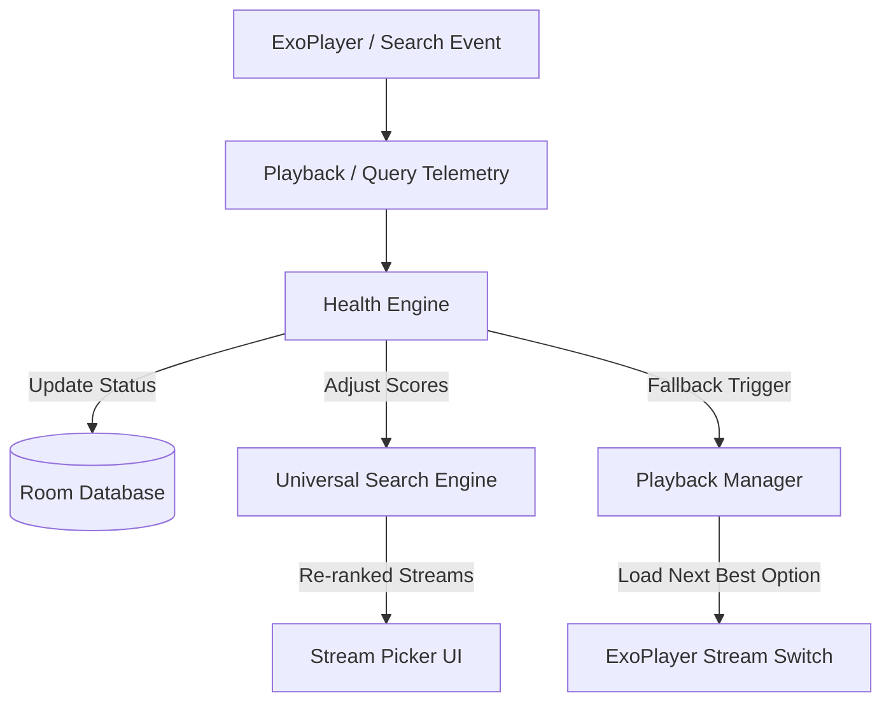

# Source Health Monitoring & Fallback Policy

This document defines the architecture, telemetry mechanisms, scoring models, and automatic fallback policies implemented to ensure playback resilience in CalmSource.

---

## 1. High-Level Architecture

CalmSource dynamically monitors the response times, query success rates, and media stream availability of all configured providers (IPTV playlists, Xtream API servers, Stremio addons, and Debrid caching accounts). By calculating real-time **Source Health Scores**, the system sanitizes the search indexing pipeline and automates stream fallback during playback errors. The **Source Intelligence** layer is responsible for parsing and normalizing this metadata before it reaches the UI.

---

## 2. Health Scoring Model

Providers are categorized into six health states based on query latency and request success rate.

### A. Health States
| Health State | Semantic Meanings | UI Indicator | Action on Search |
| :--- | :--- | :--- | :--- |
| **`HEALTHY`** / **`ACTIVE`** | Low latency, zero errors. | Green | Indexed with positive ranking boost (+50) |
| **`SLOW`** | Elevated latency or intermittent failures. | Amber / Orange | Indexed with ranking penalty (-50); shorter query timeout |
| **`FAILED`** | Consecutive timeouts, server errors, or DNS resolution failures. | Red | Deprioritized in search (-200); skipped in auto-play |
| **`NEEDS_CONFIGURATION`**| Configuration missing (Stremio only). | Blue / Grey | Completely bypassed in search |
| **`DISABLED`** | User-paused provider. | Grey | Excluded from all search and playback paths |
| **`UNKNOWN`** | Newly added provider; pending first sync. | Grey | Indexed with standard priority; triggers background check |

### B. Telemetry & Transition Rules
Dynamic transitions are triggered by active polling during background checks and passive telemetry during search/playback:
*   **Latency Thresholds**:
    *   $\text{Latency} < 1500\text{ms} \implies \text{HEALTHY}$
    *   $1500\text{ms} \le \text{Latency} < 5000\text{ms} \implies \text{SLOW}$
    *   $\text{Latency} \ge 5000\text{ms} \text{ (Timeout)} \implies \text{FAILED}$
*   **Success Rate Thresholds**:
    *   $\text{Failure Rate} = 0\% \implies \text{HEALTHY}$
    *   $0\% < \text{Failure Rate} < 50\% \implies \text{SLOW}$
    *   $\text{Failure Rate} \ge 50\% \implies \text{FAILED}$
*   **Consecutive Failure Threshold**:
    *   Three (3) consecutive network or stream failures within a rolling 10-minute window will immediately transition a provider's health to `FAILED`.

---

## 3. Persisted Health Metadata

To avoid startup latency, CalmSource persists non-sensitive health metadata in the local SQLite Room database.

### A. Database Entity Schemas
*   **`IPTVProviderEntity`**:
    *   `health`: `"HEALTHY"`, `"SLOW"`, `"FAILED"`, `"DISABLED"`
    *   `lastHealthCheck`: Epoch millisecond timestamp of the last successful health sync.
    *   `averageLatencyMs`: Historical rolling average response time.
*   **`ExtensionProviderEntity`**:
    *   `health`: `"ACTIVE"`, `"SLOW"`, `"FAILED"`, `"NEEDS_CONFIGURATION"`, `"DISABLED"`, `"UNKNOWN"`
    *   `lastHealthCheck`: Epoch millisecond timestamp.
    *   `averageLatencyMs`: Historical rolling average response time.
*   **`DebridAccountEntity`**:
    *   `health`: `"HEALTHY"`, `"SLOW"`, `"FAILED"`
    *   `lastHealthCheck`: Epoch millisecond timestamp.

### B. Data Boundaries: What is NEVER Stored
To protect user privacy and prevent security vulnerabilities, the database schema strictly isolates telemetry from credentials:

> [!WARNING]
> The following attributes must **NEVER** be persisted in Room database tables:
> *   **Access / Refresh Tokens**: Kept exclusively in Keystore-backed `SecureTokenStore`.
> *   **Passwords / API Keys**: Stored in `SecureTokenStore` only.
> *   **Resolved Playback Stream URLs**: Retained strictly in volatile memory.
> *   **Raw Request Header Logs**: Redacted before logging or DB writes.

---

## 4. Playback Failure Tracking

When a media stream fails, the `PlaybackManager` catches the exception and updates provider telemetry.

### A. Error Interception
The engine listens to ExoPlayer's `Player.Listener.onPlayerError` callback:
*   **Connection Timeouts**: ExoPlayer network timeouts map to the corresponding provider's failure counter.
*   **HTTP 403 / Forbidden**: Marks the provider as `FAILED` (indicates invalid API keys or expired subscriptions).
*   **HTTP 5xx Server Errors**: Increments the failure counter.
*   **Decoder Failures**: System-level decoder issues do not penalize provider health (tracked separately).

### B. Cooldown and Recovery
*   **Backoff Period**: Once marked as `FAILED`, a provider remains in that state for a minimum 15-minute cooldown period.
*   **Automatic Retry**: After the cooldown expires, the next user action (search or stream load) will issue a low-priority validation request to determine if the provider has recovered.

---

## 5. Fallback Policy

CalmSource implements a silent, automated fallback policy to handle mid-stream failures and initialization errors without crashing or returning the user to the main menu.

### A. The Fallback Pipeline
1.  **Error Detection**: ExoPlayer throws a terminal error.
2.  **State Capture**: `PlaybackManager` notes the failed `WatchOption` and records the failure.
3.  **Alternative Identification**: The engine retrieves the list of alternative `WatchOption`s originally resolved for the media item.
4.  **Priority Resolution**:
    *   Filter out any options originating from `FAILED` providers.
    *   Sort options based on user preferences (resolution, language, dual-audio) and provider health status.
5.  **Seamless Switch**:
    *   ExoPlayer prepares the alternative URL in place.
    *   A clean overlay indicates: *"Stream failed. Retrying with backup source..."*
    *   If no alternative sources remain, the player displays a user-friendly error dialog.

---

## 6. Integrations

### A. Universal Search Integration
During the multi-provider parallel search query phase:
*   Providers marked as `FAILED` are either skipped or queried with an aggressive timeout (e.g. 1000ms instead of 5000ms).
*   Search result scores are adjusted dynamically based on provider health:
    *   `HEALTHY` / `ACTIVE`: $+50$ points.
    *   `SLOW`: $-50$ points.
    *   `FAILED`: $-200$ points.

### B. Stream Picker Integration
*   The Watch Option / Stream Picker UI displays clear semantic health indicator badges (Green dot for Active, Amber for Slow, Red for Failed).
*   Failed options are collapsed by default behind an "Unhonored Sources" toggle at the bottom of the list.

### C. IPTV / Live Integration
*   **Rapid Switching Debounce**: A 150ms debounce prevents rapid channel up/down remote triggers from overloading ExoPlayer or database sync threads.
*   **Live Backup Streams**: If an M3U playlist lists multiple URLs for the same channel name, the `ChannelQueueManager` falls back to the backup URLs before declaring the channel unavailable.

### D. Extension / Stremio Integration
*   **Isolation**: Every Stremio addon scraper runs within a coroutine guarded by `supervisorScope` and `try-catch`. A crash or timeout in a slow addon will never block or cancel other scrapers.
*   **Config Warning Bypass**: If an addon health state is `NEEDS_CONFIGURATION`, search dispatch is skipped, preventing network timeouts.

---

## 7. UI Behavior

### A. Mobile UI
*   **Health Badges**: Settings lists render green/amber/red status dots next to each provider item.
*   **Interactive Fallbacks**: Toast notifications alert the user when the player automatically switches streams.
*   **Setup Flow Warnings**: Surfaces warnings when configuring an addon that has high latency or missing parameters.

### B. TV UI (Leanback & D-Pad)
*   **Couch Readability**: High-contrast, color-blind friendly text tags represent provider health.
*   **Focus Transitions**: TV D-pad handles focus shifts cleanly without lag when scrolling past "Failed" or "Slow" sources.
*   **Actionable Prompts**: If a user selects a `FAILED` source, a dialog asks: *"This provider is currently offline. Force retry?"* rather than launching the player directly.

---

## 8. Performance Strategy

*   **Asynchronous Processing**: All health validations are run off the main thread using `Dispatchers.IO` to protect UI responsiveness on low-end TV chipsets.
*   **Debounced Database Writes**: Telemetry updates are batched and written to the database with a 5-second debounce window to prevent database write thrashing.
*   **Lazy Telemetry Initialization**: Health database tables are queried lazily, ensuring zero overhead during application startup.

---

## 9. Privacy & Security Rules (Source Intelligence)

*   **URL Redaction**: All request URLs used in health-checking logs are redacted using `UrlRedactor` to strip credentials, API keys, and private query parameters.
*   **No Raw URLs Exposed**: The Source Intelligence layer ensures that raw filenames, direct links, and private query parameters are NEVER exposed to the UI by default.
*   **Query Stripping**: Any telemetry or diagnostic logging strips personally identifiable parameters and sensitive access tokens before writing to disk or console.
*   **Local Telemetry Only**: Health and latency metrics are compiled locally on the device. No external analytics, reporting servers, or telemetry collection portals are accessed.

---

## 10. Known Limitations

1.  **Global Network Loss**: If the host device loses internet connectivity, all providers will transiently transition to `FAILED`. A manual "Network Reconnected" trigger is required to restore status without waiting for cooldown timers.
2.  **No Timezone Drift Compensation**: Health checks do not currently offset latency calculations for timezone drifts or geographical routing constraints.

---

## 11. Next Steps

1.  **Periodic Background Checking**: Integrate Android `WorkManager` to run daily background health checks for all configured Stremio addons and IPTV providers.
2.  **Interactive EPG Health Overlays**: Show channel health status directly inside the live EPG program grid.
