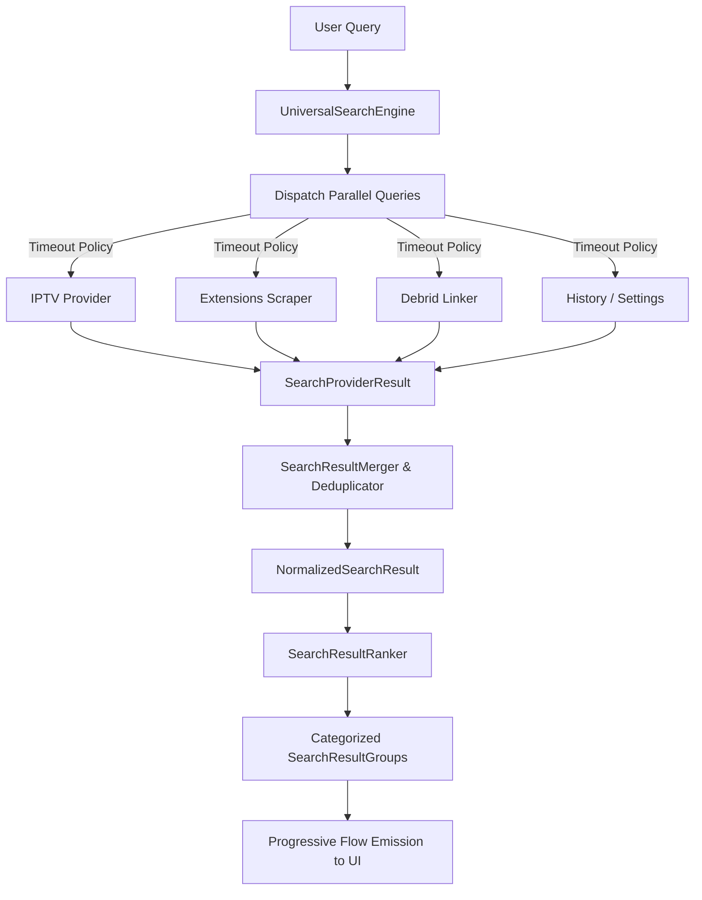

# Production-Grade Universal Search Architecture

This document describes the design, pipeline phases, and extension points of the CalmSource Universal Search engine.

---

## 1. High-Level Search Architecture

CalmSource utilizes a decoupled, provider-based architecture using Kotlin Coroutines and Flows. When a user enters a search query:
1.  **Session Initialization**: A `SearchQuery` is created, and a new `SearchSession` registers active asynchronous tasks.
2.  **Parallel Query Dispatching**: All enabled `SearchProviders` are queried concurrently on background threads (`Dispatchers.Default`).
3.  **Timeout Enforcement**: Each query is wrapped in a `withTimeout` block applying a `SearchTimeoutPolicy` to prevent slow providers from locking the search flow.
4.  **Progressive Result Streaming**: Results are emitted progressively as soon as fast providers resolve.
5.  **Source Intelligence & Deduplication**: The Source Intelligence layer processes raw search records, parsing and modeling them uniformly. They are consolidated into title-first results, graded against user preferences by the Source Ranker, and categorized into logical search result groups.



---

## 2. The Provider Model

Every indexing source implements the `SearchProvider` interface defined in [SearchInterfaces.kt](file:///d:/Program%20Files/iptv/feature/search/src/main/kotlin/com/example/calmsource/feature/search/SearchInterfaces.kt):

```kotlin
interface SearchProvider {
    val id: String
    val name: String
    val priority: Int
    suspend fun search(query: SearchQuery, prefs: UserPreferences): SearchProviderResult
}
```

### Registered Providers
1.  `IPTVSearchProviderImpl` – Queries live channels matching query text, including Xtream-sourced live channels. (High Priority/Instant).
2.  `EPGSearchProviderImpl` – Filters live EPG guides for currently airing programs. (High Priority).
3.  `VODSearchProviderImpl` – Resolves local IPTV VOD matches, Xtream VOD movies (from `XtreamVodEntity`), and Xtream series metadata (from `XtreamSeriesEntity`), mapping and merging them into title-first Movie/Show results to avoid duplicate layout cards. (High Priority).
4.  `ExtensionSearchProviderImpl` – Queries all enabled extensions registered in `ExtensionRepository` that support `SEARCH` and `STREAM` capabilities. Standard Stremio catalog JSON endpoints are queried dynamically. (Medium Priority).
5.  `DebridAvailabilityProviderImpl` – Links cached torrent indices from connected debrid services. (Medium Priority).
6.  `SubtitleSearchProviderImpl` – Matches stream subtitles with user preferences. (Low Priority).
7.  `MetadataSearchProviderImpl` – Enriches movie/show overviews, rating, and artwork. (Low/Medium Priority).
8.  `HistorySearchProviderImpl` – Scans user watch history for matches. (Very High Priority).
9.  `SettingsSearchProviderImpl` – Offers setting panel shortcuts (e.g. searching "priority" directs to priority settings). (Low Priority).

---

## 3. Deduplication & Merging Strategy

### Deduplication
To keep the search results screen clean, CalmSource collapses duplicate listings of the same movie or show into a single `NormalizedSearchResult` card.
*   **Grouping Criteria**: Grouped by `mediaItem.id`.
*   **Consolidation**: Combines all watch options (resolutions, audio tracks, subtitles) under one card.
*   **Result Badging**: Displays badges indicating all available sources (e.g., `IPTV`, `EXTENSION`, `DEBRID`) and audio configurations.

### Merging
Normalized results are classified into groups defined by `SearchGroupType`:
*   `Top Results` – The absolute highest-scoring result across all providers.
*   `Movies` / `Shows` – Enriched on-demand catalogs.
*   `Live Channels` / `Live Programs` – Currently airing broadcast grids.
*   `IPTV VOD` – Specific exact-match video playlists.
*   `Extension Results` – Standard scraped content links.
*   `Settings` – Navigational settings paths.

---

## 4. Ranking Strategy (Source Intelligence)

The Source Intelligence layer (specifically `SourceRanker` in `core/sourceintelligence/`) calculates a score for each stream option according to:
1.  **Primary Language Match**: $+200$ points.
2.  **Secondary Language Match**: $+100$ points.
3.  **Prefer Dual Audio**: $+80$ points (if dual-audio matches).
4.  **Prefer Dubbed Audio**: $+60$ points.
5.  **IPTV VOD Preference**: $+150$ points (if matched and exact match preferred).
6.  **Cached Debrid Availability**: $+150$ points (if cached on debrid).
7.  **Prefer Cached Debrid**: $+120$ points (if cached debrid preferred).
8.  **Quality Resolution**: 4K ($+100$), 1080p ($+80$), 720p ($+40$).
9.  **Subtitle Match**: $+40$ points.
10. **Provider Health**: Healthy ($+50$), Slow ($-50$), Failed ($-200$).

The overall search card is further boosted by:
*   **Exact Title Match**: $+1000$ points.
*   **Favorites Bookmarked**: $+500$ points.
*   **Watch History Match**: $+300$ points.

---

## 5. Timeout & Error Strategy

*   **Isolation**: Every provider search call is executed in a try-catch block inside `UniversalSearchEngineImpl`. If a single extension scraper throws an exception, the flow handles it and continues, preserving results from other healthy providers.
*   **Timeout Limits**: Providers must complete within the allocated time defined in the `SearchTimeoutPolicy`.
    *   *Default*: $5000$ ms.
    *   *Custom Overrides*: e.g. 500 ms limit for slow scrapers, 50 ms limit for history checks.
    *   *Dynamic Health Caps*: Providers marked as `SLOW` or `FAILED` are automatically clamped to a shorter query timeout (e.g., $1000$ ms) during search dispatch, ensuring that slow endpoints do not bottleneck the progressive streaming of healthy results.
*   If a timeout occurs, the engine returns a placeholder with a timeout exception, ensuring that the main search flow continues without delay.

---

## 6. Real vs. Placeholder Status

1.  **IPTV Services**: **100% Real**. Queries Room database instances containing indexed M3U playlists instead of fake static channels.
2.  **XMLTV EPG**: **100% Real**. Queries EPG programs table in Room database.
3.  **Extensions (Stremio/AIOStreams)**: **100% Real**. `ExtensionSearchProvider` issues concurrent HTTP GET calls using Ktor client to query `/catalog` endpoints based on user-installed manifests.
4.  **Debrid Account Check**: **Placeholder**. The availability provider is stubbed, but the secure token storage layer is fully production-ready.
5.  **Watch History & Favorites**: Queries Room database entities. Note: With the new Playback foundation, the real ExoPlayer integration supports tracking watch history in the future.

---

## 7. Further Documentation
*   For details on the parsing, modeling, ranking, and UI integration layer that processes raw metadata, see [SOURCE_INTELLIGENCE.md](./SOURCE_INTELLIGENCE.md).
*   For detailed stream health tracking and fallback strategies, see [SOURCE_HEALTH_AND_FALLBACK.md](./SOURCE_HEALTH_AND_FALLBACK.md).
