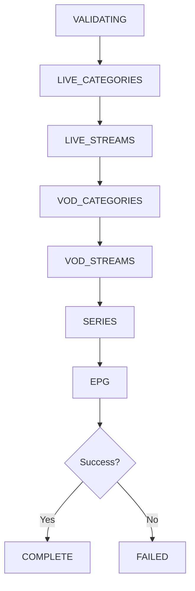

# Xtream-Compatible IPTV API Sync

This document provides comprehensive documentation of the Xtream-compatible API synchronization system in CalmSource — covering endpoint specifications, authentication flows, the sync pipeline, credential storage, Room persistence, search/playback integration, and UI considerations for both Mobile and TV form factors.

---

## 1. Overview

CalmSource supports syncing user-provided lawful IPTV services via Xtream-compatible APIs. Users supply their own server URL, username, and password for services they have legally subscribed to. The sync pipeline authenticates against the provider, retrieves live TV categories and channels, VOD categories and streams, series metadata, and optionally short EPG data — persisting non-secret metadata in Room and making it available through Universal Search and live TV playback.

---

## 2. Legal Boundary

CalmSource is a **legal media player**. It does not:
*   Bundle, ship, or recommend any IPTV provider credentials.
*   Include any public provider lists, server URLs, or default accounts.
*   Endorse, facilitate, or promote unauthorized access to copyrighted content.

Users are solely responsible for the legality of the IPTV services they connect. CalmSource acts exclusively as a client player for user-owned subscriptions.

---

## 3. Endpoint Assumptions

CalmSource targets the widely adopted Xtream-compatible API protocol. All endpoints are queried against the user-provided server base URL.

### A. Authentication (`player_api.php`)

**Request:**
```
GET {server}/player_api.php?username={username}&password={password}
```

**Response (JSON):**
```json
{
  "user_info": {
    "username": "...",
    "password": "...",
    "message": "...",
    "auth": 1,
    "status": "Active",
    "exp_date": "1735689600",
    "is_trial": "0",
    "active_cons": "1",
    "created_at": "1704067200",
    "max_connections": "1",
    "allowed_output_formats": ["m3u8", "ts", "rtmp"]
  },
  "server_info": {
    "url": "...",
    "port": "...",
    "https_port": "...",
    "server_protocol": "http",
    "rtmp_port": "...",
    "timezone": "UTC",
    "timestamp_now": 1719840000,
    "time_now": "2025-07-01 12:00:00"
  }
}
```

### B. Get Live Categories

**Request:**
```
GET {server}/player_api.php?username={username}&password={password}&action=get_live_categories
```

**Response:**
```json
[
  { "category_id": "1", "category_name": "Sports", "parent_id": 0 },
  { "category_id": "2", "category_name": "News", "parent_id": 0 }
]
```

### C. Get Live Streams

**Request:**
```
GET {server}/player_api.php?username={username}&password={password}&action=get_live_streams
```

**Response:**
```json
[
  {
    "num": 1,
    "name": "BBC One HD",
    "stream_type": "live",
    "stream_id": 12345,
    "stream_icon": "https://example.com/bbc1.png",
    "epg_channel_id": "bbc1.uk",
    "category_id": "2",
    "tv_archive": 0,
    "tv_archive_duration": 0,
    "is_adult": "0",
    "custom_sid": ""
  }
]
```

### D. Get VOD Categories

**Request:**
```
GET {server}/player_api.php?username={username}&password={password}&action=get_vod_categories
```

**Response:** Same format as live categories — `[{ category_id, category_name, parent_id }]`

### E. Get VOD Streams

**Request:**
```
GET {server}/player_api.php?username={username}&password={password}&action=get_vod_streams
```

**Response:**
```json
[
  {
    "num": 1,
    "name": "Inception",
    "stream_type": "movie",
    "stream_id": 67890,
    "stream_icon": "https://example.com/inception.jpg",
    "category_id": "10",
    "container_extension": "mkv",
    "rating": "8.8",
    "added": "1704067200"
  }
]
```

### F. Get Series Categories

**Request:**
```
GET {server}/player_api.php?username={username}&password={password}&action=get_series_categories
```

**Response:** Same format as live/VOD categories.

### G. Get Series

**Request:**
```
GET {server}/player_api.php?username={username}&password={password}&action=get_series
```

**Response:**
```json
[
  {
    "num": 1,
    "name": "Breaking Bad",
    "series_id": 999,
    "cover": "https://example.com/bb.jpg",
    "category_id": "15",
    "rating": "9.5",
    "plot": "A chemistry teacher turns to cooking methamphetamine...",
    "genre": "Drama, Crime",
    "cast": "Bryan Cranston, Aaron Paul",
    "releaseDate": "2008"
  }
]
```

### H. Get Short EPG

**Request:**
```
GET {server}/player_api.php?username={username}&password={password}&action=get_short_epg&stream_id={stream_id}
```

**Response:**
```json
{
  "epg_listings": [
    {
      "id": "12345",
      "epg_id": "bbc1.uk",
      "title": "QkJDIE5ld3M=",
      "lang": "en",
      "start": "2025-07-01 18:00:00",
      "end": "2025-07-01 18:30:00",
      "description": "RXZlbmluZyBuZXdzIGJ1bGxldGlu",
      "channel_id": "bbc1.uk"
    }
  ]
}
```

> [!NOTE]
> EPG `title` and `description` fields are often Base64-encoded. The sync engine decodes them before persisting.

---

## 4. Stream URL Construction

Stream URLs are constructed lazily at playback time using the provider's server URL, credentials, and stream ID.

| Stream Type | URL Format | Example |
|---|---|---|
| Live | `{server}/live/{username}/{password}/{stream_id}.ts` | `http://example.com:8080/live/user1/pass1/12345.ts` |
| VOD | `{server}/movie/{username}/{password}/{stream_id}.{ext}` | `http://example.com:8080/movie/user1/pass1/67890.mkv` |
| Series Episode | `{server}/series/{username}/{password}/{episode_id}.{ext}` | `http://example.com:8080/series/user1/pass1/111.mp4` |

> [!IMPORTANT]
> Stream URLs are **never persisted** to Room or logged. They are constructed on-the-fly from the `stream_id` (stored in Room) and credentials (retrieved from `SecureTokenStore`) only at the moment of playback. The `UrlRedactor` strips credentials from any URL before logging or UI display.

---

## 5. Auth Flow

Authentication is the first stage of the sync pipeline:

1. **User Input** — User provides server URL, username, and password via the login form.
2. **Validate Credentials** — `XtreamApiClient` sends a GET request to `player_api.php` with credentials.
3. **Parse Response** — Extract `user_info` and `server_info` from the JSON response.
4. **Check Auth** — Verify `user_info.auth == 1` and `user_info.status == "Active"`.
5. **Check Expiry** — Parse `user_info.exp_date` (Unix timestamp) and verify the subscription has not expired.
6. **Store Credentials** — On successful validation:
   - **Password** → `IptvSecureTokenStore` (Android Keystore-backed encryption)
   - **Server URL + Username + Provider metadata** → Room `IPTVProviderEntity` (non-secret)
7. **Failure Handling** — Invalid credentials, expired subscriptions, or unreachable servers produce user-friendly error messages without exposing raw API responses.

---

## 6. Sync Pipeline

The sync pipeline executes sequentially through the following stages, updating the UI with progress at each step:



| Stage | Description | Room Entity |
|---|---|---|
| `VALIDATING` | Authenticate and verify subscription | `IPTVProviderEntity` |
| `LIVE_CATEGORIES` | Fetch live TV category groups | `XtreamCategoryEntity` |
| `LIVE_STREAMS` | Fetch all live channels | `IPTVChannelEntity` |
| `VOD_CATEGORIES` | Fetch VOD category groups | `XtreamCategoryEntity` |
| `VOD_STREAMS` | Fetch all VOD movies | `XtreamVodEntity` |
| `SERIES` | Fetch series metadata | `XtreamSeriesEntity` |
| `EPG` | Fetch short EPG for live channels (if available) | `EPGProgramEntity` |
| `COMPLETE` | All stages succeeded | — |
| `FAILED` | Any stage failed, error message saved | — |

Each stage is individually cancellable. If the user cancels or the app backgrounds, partial data from completed stages is retained.

---

## 7. Credential Storage Rules

CalmSource enforces a strict separation between public metadata and secret credentials for Xtream providers:

### Stored in `IptvSecureTokenStore` (Encrypted — NEVER in Room)

| Data | Token Type Key |
|---|---|
| Xtream Password | `xtream_password` |

### Stored in Room (Non-Secret Metadata Only)

| Data | Entity | Field |
|---|---|---|
| Provider ID | `IPTVProviderEntity` | `id` |
| Provider Name | `IPTVProviderEntity` | `name` |
| Provider Type | `IPTVProviderEntity` | `type` (XTREAM) |
| Server URL | `IPTVProviderEntity` | `playlistUrl` |
| Username | `IPTVProviderEntity` | `username` |
| Enabled State | `IPTVProviderEntity` | `isEnabled` |
| Health | `IPTVProviderEntity` | `health` |

### Data That Must NEVER Be Stored in Room

| Forbidden Data | Reason |
|---|---|
| Xtream password | Credential — belongs in SecureTokenStore only |
| Constructed stream URLs | Contain embedded credentials; built lazily at playback time |
| Raw API responses | Could leak passwords in database exports/backups |

### Enforcement

- **Code design**: `XtreamRepository` stores `password = null` in all entity objects. Passwords are retrieved lazily from `IptvSecureTokenStore` only when making API calls or constructing stream URLs.
- **Reflection audit**: `RoomSecurityAuditTest` scans all entity classes and asserts no forbidden credential field names exist (including `password`).
- **Provider removal**: Deleting an Xtream provider immediately purges its password from `IptvSecureTokenStore` via `clearProvider()`.

---

## 8. Room Metadata Rules

Room entities store only safe, non-secret fields:

### Xtream Category Entity

| Field | Type | Description |
|---|---|---|
| `id` | `String` | Composite key: `{providerId}_{categoryId}` |
| `providerId` | `String` | Parent provider ID |
| `categoryId` | `String` | Xtream category ID |
| `categoryName` | `String` | Display name |
| `categoryType` | `String` | `live`, `vod`, or `series` |
| `parentId` | `Int` | Parent category (0 = root) |

### Xtream VOD Entity

| Field | Type | Description |
|---|---|---|
| `id` | `String` | Composite key: `{providerId}_{streamId}` |
| `providerId` | `String` | Parent provider ID |
| `streamId` | `Int` | Xtream stream ID |
| `name` | `String` | Movie title |
| `streamIcon` | `String?` | Poster URL |
| `categoryId` | `String?` | Category grouping |
| `containerExtension` | `String?` | File format (mkv, mp4) |
| `rating` | `String?` | Content rating |

### Xtream Series Entity

| Field | Type | Description |
|---|---|---|
| `id` | `String` | Composite key: `{providerId}_{seriesId}` |
| `providerId` | `String` | Parent provider ID |
| `seriesId` | `Int` | Xtream series ID |
| `name` | `String` | Series title |
| `cover` | `String?` | Cover art URL |
| `categoryId` | `String?` | Category grouping |
| `rating` | `String?` | Content rating |
| `plot` | `String?` | Synopsis |
| `genre` | `String?` | Genre tags |

> [!IMPORTANT]
> None of these entities contain passwords, tokens, constructed URLs, or any data that could be used to derive credentials.

---

## 9. Search Integration

Xtream content is integrated into CalmSource's Universal Search through the existing provider model:

### Live Channels
- **Provider**: `IPTVSearchProviderImpl` queries Room for live channels matching the search query text.
- Xtream live channels are indexed alongside M3U-sourced channels via the shared `IPTVChannelEntity` table.
- Results appear in the "Live Channels" search group with `IPTV` source badges.

### VOD Content
- **Provider**: `VODSearchProviderImpl` queries the `XtreamVodEntity` table for VOD movies matching query text.
- Results are mapped into title-first `NormalizedSearchResult` cards and merged with extension results.
- Duplicate entries (e.g., same movie available from both Xtream VOD and Stremio) are consolidated into single cards with multiple source badges.
- Results appear in the "IPTV VOD" or "Movies" search groups.

### Series Content
- **Provider**: Series metadata from `XtreamSeriesEntity` is searchable through `VODSearchProviderImpl`.
- Results appear in the "Shows" search group.

All Xtream search results participate in the standard Source Intelligence ranking pipeline, receiving scores based on language match, resolution, provider health, and user preferences.

---

## 10. Playback Integration

Stream URLs are built lazily at playback time from:
1. **`stream_id`** — retrieved from Room (`IPTVChannelEntity.streamId` or `XtreamVodEntity.streamId`)
2. **Server URL** — retrieved from Room (`IPTVProviderEntity.playlistUrl`)
3. **Credentials** — retrieved from `IptvSecureTokenStore` (username stored in Room, password from SecureTokenStore)

### Playback Flow
```
User selects channel/VOD → Retrieve stream_id from Room 
    → Retrieve credentials from SecureTokenStore 
    → Construct URL: {server}/{type}/{user}/{pass}/{stream_id}.{ext}
    → Create PlaybackSource (URL in memory only)
    → Hand off to ExoPlayer via PlaybackManager
```

### Security Guarantees
- The constructed URL is **never persisted** to Room, logs, or analytics.
- `PlaybackSource.redactUrl` strips username and password segments before any logging or UI display.
- ExoPlayer error messages are caught and mapped to generic error codes — raw URLs are never shown to the user.

---

## 11. Mobile UI

### Login Form
- Text fields for: **Server URL**, **Username**, **Password**, and **Provider Name**.
- Password field uses `PasswordVisualTransformation` with a visibility toggle.
- "Connect" button triggers async validation with a progress indicator.
- Error states display user-friendly messages (invalid credentials, expired subscription, unreachable server).

### Sync Trigger
- "Sync Now" button on the IPTV provider details screen.
- Progress bar shows current sync stage (e.g., "Syncing Live Channels... 45%").
- Cancel button allows aborting the sync mid-flight.

### Provider Summary
- Provider card shows: name, server URL (redacted), username, sync status, channel count, VOD count.
- Delete button removes the provider and purges credentials from SecureTokenStore.

---

## 12. TV UI

### D-pad Accessible Login
- All input fields are focusable and navigable via D-pad directional keys.
- Focus transitions cleanly between Server URL → Username → Password → Provider Name → Connect button.
- On-screen keyboard integration for text entry on TV devices.
- Large, high-contrast text readable from couch distance (10 ft / 3m).

### Sync Display
- Full-screen progress overlay during sync with stage indicator.
- D-pad back button cancels sync with confirmation dialog.
- Provider management accessible from TV Settings split-pane.

---

## 13. Performance Strategy

### Batch Room Inserts
- Large provider syncs (10,000+ channels) use batch Room inserts of **500 items per transaction**.
- All database operations execute on `Dispatchers.IO` to avoid blocking the UI thread.
- Channel/category sync uses `@Transaction` to ensure atomic replacement (delete old → insert new).

### Off-Main-Thread Sync
- The entire sync pipeline runs in a coroutine on `Dispatchers.IO`.
- UI progress updates are posted to `StateFlow` from the IO thread and collected on the main thread.
- Network requests use Ktor `HttpClient` configured with timeouts (connect: 10s, read: 30s).

### Bounded Response Sizes
- API responses are size-limited via the existing Ktor response interceptor (5MB max per response).
- Providers with extremely large channel lists (100K+) are handled via chunked parsing without loading the full response body into a single String.

---

## 14. Privacy & Security Rules

| Rule | Enforcement |
|---|---|
| Password stored only in SecureTokenStore | Code design + `RoomSecurityAuditTest` |
| Password never in Room entities | Reflection-based entity audit |
| Password never logged | `UrlRedactor` strips credentials from URLs; no raw password logging |
| Password never in error messages | ExoPlayer errors mapped to generic codes |
| Password never in UI | Password field uses visual transformation; provider details redact server URLs |
| Stream URLs never persisted | Constructed lazily; handed to ExoPlayer in-memory only |
| Stream URLs never logged | `PlaybackSource.redactUrl` used before any logging |
| Provider deletion purges credentials | `IptvSecureTokenStore.clearProvider()` called on provider removal |
| API responses not cached raw | Only parsed fields (non-secret) persisted to Room |

---

## 15. What Is Real vs. Placeholder

| Component | Status | Details |
|---|---|---|
| Authentication | ✅ Real | `player_api.php` credentials validation against live servers |
| Live Categories Sync | ✅ Real | `get_live_categories` fetch and Room persistence |
| Live Streams Sync | ✅ Real | `get_live_streams` fetch and Room persistence |
| VOD Categories Sync | ✅ Real | `get_vod_categories` fetch and Room persistence |
| VOD Streams Sync | ✅ Real | `get_vod_streams` fetch and Room persistence |
| Series Metadata Sync | ⚡ Basic | `get_series` top-level metadata fetched; episode detail API not yet integrated |
| Short EPG | ⚡ Conditional | `get_short_epg` fetched when available; not all providers support it |
| Stream URL Construction | ✅ Real | Lazy URL construction from stream_id + credentials |
| Credential Storage | ✅ Real | `IptvSecureTokenStore` with Android Keystore encryption |
| Search Integration | ✅ Real | Live + VOD + Series searchable via Universal Search |
| Playback | ✅ Real | ExoPlayer plays Xtream live/VOD streams |

---

## 16. Known Limitations

| Limitation | Impact | Plan |
|---|---|---|
| No catch-up playback | Users cannot watch time-shifted/recorded content | Future: `tv_archive` support via Xtream timeshift API |
| No series episode details | Only series-level metadata synced; individual episodes not yet fetched | Future: `get_series_info` API integration |
| No offline playback | Content cannot be downloaded for offline viewing | Out of scope — streaming only |
| EPG Base64 decoding fragility | Some providers use non-standard encoding | Graceful fallback to raw text |
| No multi-connection management | Single active connection per provider | Future: connection pooling |
| Series episode playback | Cannot browse/play individual series episodes | Requires `get_series_info` API |

---

## 17. Next Steps

1. **Series Detail API** — Implement `get_series_info` endpoint to fetch season/episode breakdowns and enable per-episode playback.
2. **Catch-Up Playback** — Support time-shifted content using the `tv_archive` and `tv_archive_duration` fields via Xtream timeshift URLs.
3. **EPG Guide Integration** — Deep integration of Xtream short EPG data into the Live TV Guide grid, including program reminders and genre filtering.
4. **Multi-Server Support** — Allow users to connect multiple Xtream providers simultaneously with unified search across all.
5. **Background Sync** — Implement periodic background sync via `WorkManager` to keep channel/VOD listings up-to-date.
6. **Provider Health Monitoring** — Track Xtream server availability and response times via the existing source health framework.

---

## 18. Further Documentation

*   For comprehensive IPTV and M3U specifications, see [IPTV_AND_EPG.md](./IPTV_AND_EPG.md).
*   For live TV playback architecture, see [LIVE_TV_PLAYBACK.md](./LIVE_TV_PLAYBACK.md).
*   For general playback architecture, see [PLAYBACK.md](./PLAYBACK.md).
*   For secure credential storage details, see [SECURE_STORAGE.md](./SECURE_STORAGE.md).
*   For security policy, see [SECURITY.md](./SECURITY.md).
*   For Universal Search architecture, see [UNIVERSAL_SEARCH.md](./UNIVERSAL_SEARCH.md).
*   For performance strategies, see [PERFORMANCE.md](./PERFORMANCE.md).
